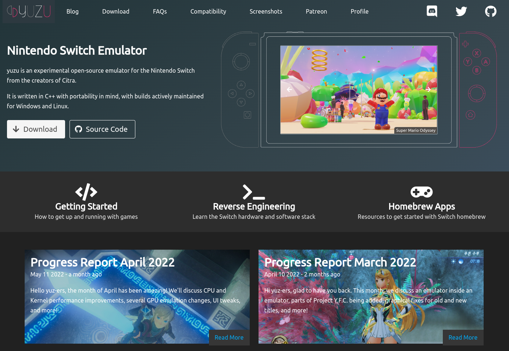

# 1 关于

该仓库是笔者星标过的仓库合集，虽然Github已经自带分类功能，但是仅仅只有仓库列表，也不支持图片以及外链，因此决定专门开一个仓库记录星标过的仓库，同时进行基本的分类，以及添加了方便搜索的标签。

~~一句话总结：只是因为懒或忘记过星标的仓库而做的一个备忘录。~~

# 2 工具类

## 分类说明

该分类是一些小工具的分类，包括但不限于插件、脚本等等。

## [YouCompleteMe](https://github.com/ycm-core/YouCompleteMe)

  

一个`Vim`的多语言代码补全引擎。

特点：

- 补全智能排序以及过滤
- 文件以及路径补全
- 支持`omnifunc`
- 支持`UltiSnips`

标签：代码补全、补全、`Vim`、引擎


## [GM_script](https://github.com/langren1353/GM_script)

  

`AC-baidu`，一个可以优化百度谷歌搜索的脚本，功能包括：

- 去广告
- 护眼模式
- 支持自定义页面效果
- 支持单列、双列、多列模式
- 异步请求


标签：百度、谷歌、优化、去广告、搜索、多列

## **[vimium-c](https://github.com/gdh1995/vimium-c)**

  

[Vimium](https://github.com/philc/vimium)（以操作`Vim`的方式操作浏览器）的一款修改版，在原版基础上添加了完整的中文支持以及全局快捷键等功能。


标签：`Vimium`、插件、中文支持、`Vim`、浏览器

## [croc](https://github.com/schollz/croc)

  

`CLI`文件传输工具，特性如下：

- 支持任意两台电脑之间传输
- 使用`PAKE`提供端到端加密
- 允许跨平台传输
- 支持多文件传输
- 支持断点续传
- 不需要本地服务器或端口转发
- `IPv6`优先
- 支持代理


标签：文件传输

## [shellcheck](https://github.com/koalaman/shellcheck)

  

`shell`静态分析工具，目标：

- 对于初学者，指出语法问题
- 对于有一定经验的使用者，指出可能导致异常行为的语义问题
- 对于进阶使用者，指出陷阱以及可能会失败的极端情况

## [lsix](https://github.com/hackerb9/lsix)

 

用于图片的"`ls`"工具，也就是直接在终端中`ls`出图片。需要终端支持`sixel`格式。


标签：图片、图像、终端显示

# 3 书籍类

## 分类说明

该分类以免费书籍为主。

## [free-programming-books-zh_CN](https://github.com/justjavac/free-programming-books-zh_CN)


免费编程中文书籍索引。

标签：书籍、中文、中文书籍、免费、索引

## [free-programming-books](https://github.com/EbookFoundation/free-programming-books)


多语言免费学习资源。

标签：书籍、学习、免费、多语言

## [awesome-java-books](https://github.com/sorenduan/awesome-java-books)


`Java`技术书籍大全。目录：


标签：`Java`、技术书籍 

# 4 Spring Boot类

## 分类说明

该分类包含`Spring Boot`的一些教程或者示例。

## [SpringBoot-Learning](https://github.com/dyc87112/SpringBoot-Learning)

  

`Spring Boot`基础教程，从2016年连载至今，包括`1.x`以及`2.x`版本。

标签：`Spring Boot`、教程

## [springboot-learning-example](https://github.com/JeffLi1993/springboot-learning-example)

  

`Spring Boot 2.x`系列教程。

标签：`Spring Boot`、教程

## [springBoot](https://github.com/527515025/springBoot)

  

`SpringBoot`框架与其它组件结合如 `JPA`、`MyBatis`、`WebSocket`、`Spring Security`、`Shiro`、`cache`等。

标签：`Spring Boot`、组件

## [spring-boot-examples](https://github.com/ityouknow/spring-boot-examples)

 

`Spring Boot`学习示例。

标签：`Spring Boot`

## [springboot-guide](https://github.com/CodingDocs/springboot-guide)

 

`SpringBoot 2.0+`从入门到实战。


~~Logo非常地皮啊~~

标签：`Spring Boot`

# 5 项目/系统类

## 分类说明

该分类包含一些实用性比较强的项目或系统。

## [mall](https://github.com/macrozheng/mall)

              

`mall`是一套电商系统，包括前台商城系统以及后台管理系统。

前台商城包括：

- 首页门户
- 商品推荐
- 商品搜索
- 商品展示

等，后台管理系统包括：

- 商品管理
- 订单管理
- 会员管理
- 促销管理

等。


标签：商城、电商、后台管理、前台商城

## [VBlog](https://github.com/lenve/VBlog)

     

V部落是一个多用户博客管理平台，采用`Vue`+`SpringBoot`开发。


标签：博客、博客平台、多用户

## [miaosha](https://github.com/qiurunze123/miaosha)

 

秒杀系统设计与架构。


标签：秒杀

## **[qwerty-learner](https://github.com/Kaiyiwing/qwerty-learner)**

  

为键盘工作者设计的单词记忆与英语肌肉记忆锻炼的一个网站。

内置词库包括：

- `CET4`
- `CET6`
- `GMAT`
- `GRE`
- `IELTS`
- `SAT`
- `TOEFL`

等等，[在线访问](https://qwerty.kaiyi.cool/)。


标签：单词

# 6 娱乐类

## 分类说明

娱乐最重要，人活着就是为了开心。

## [BullshitGenerator](https://github.com/menzi11/BullshitGenerator)

  

狗屁不通文章生成器。[在线浏览](https://suulnnka.github.io/BullshitGenerator/index.html)。

标签：文章、生成器、狗屁不通

## [1s](https://github.com/justjavac/1s)


有些网站`+1s`的时候，会有意想不到的奇效，暂时收录的网站包括：

- `Github`
- `Youtube`
- `Tiktok`


## [logoly](https://github.com/bestony/logoly)

    

某某`Logo`样式生成器。


标签：`logo`、生成

# 7 awesome类

## 分类说明

此分类包含一些以`awesome-`开头的仓库或者是一些以仓库集合为主的仓库。

## [HelloGitHub](https://github.com/521xueweihan/HelloGitHub)


`HelloGitHub`分享`GitHub`上有趣、入门级的开源项目，每月28号以月刊的形式更新发布。

项目包括：

- 有趣、入门级的项目
- 开源书籍
- 实战项目
- 企业项目

等等。

标签：开源项目、合集

## [Awesome-Linux-Software](https://github.com/luong-komorebi/Awesome-Linux-Software)

 

`Linux`软件合集，分类包括：

- 音频
- 电子书
- 游戏
- 图形
- 办公
- 代理
- 安全

等等，种类非常齐全。

标签：`Linux`、软件

## [ChromeAppHeroes](https://github.com/zhaoolee/ChromeAppHeroes)

 

`Chrome`插件英雄榜，包含了一大堆有用的`Chrome`插件。


标签：插件、扩展

# 8 库类

## 分类说明

此分类是一些语言的常用库。

## [okhttp](https://github.com/square/okhttp)

  

一个`HTTP`客户端，功能包括：

- `HTTP/2`支持
- 将连接池化以请求延迟
- 支持`GZIP`
- 支持将响应缓存

标签：`HTTP`、`HTTP/2`、同步、异步、请求

## [APlayer](https://github.com/DIYgod/APlayer)

 

一个漂亮的`H5`音乐播放器，支持格式包括：

- `H.264`（`AAC`或`MP3`）
- `WAVE PCM`
- `Ogg Theora Vorbis`

同时也支持歌词以及播放列表。


标签：播放器、音乐

## [maven-shade-plugin](https://github.com/apache/maven-shade-plugin)

 

`Apache Maven Shade`插件，用于打包`Maven`项目。

标签：`Maven`、打包

## [element-plus](https://github.com/element-plus/element-plus)

  

`element`团队出品的一个面向设计师以及开发者的组件库，设计原则：

- 一致：与现实生活一致、在界面中一致
- 反馈：控制反阔、页面反阔
- 效率：简化流程、清晰明确、帮助用户识别
- 可控：用户决策、结果可控

组件包括：

- 按钮
- 布局容器
- 表单
- 输入框
- 单选框/多选框
- 滑块
- 日历
- 走马灯
- 分页

等等。

标签：`Vue3`、`UI`、组件库

## [retrofit](https://github.com/square/retrofit)

 

为安卓和`JVM`打造的一个类型安全的`HTTP`客户端。

代码示例：

```java
//定义接口
public interface GitHubService {
  @GET("users/{user}/repos")
  Call<List<Repo>> listRepos(@Path("user") String user);
}

//生成Retrofit
Retrofit retrofit = new Retrofit.Builder()
    .baseUrl("https://api.github.com/")
    .build();

//生成实例化接口
GitHubService service = retrofit.create(GitHubService.class);

//调用
Call<List<Repo>> repos = service.listRepos("octocat");
```


标签：`HTTP`、客户端、类型安全

## [Anti-recall](https://github.com/JasonQS/Anti-recall)

 

安卓免`root`防撤回神器，可惜不再开源 。


标签：免`root`、防撤回

## [EasyOCR](https://github.com/JaidedAI/EasyOCR)

 

`OCR`工具，支持通过`pip`安装。

示例代码：

```python
import easyocr
reader = easyocr.Reader(['ch_sim','en']) # this needs to run only once to load the model into memory
result = reader.readtext('chinese.jpg')

# 输出
[([[189, 75], [469, 75], [469, 165], [189, 165]], '愚园路', 0.3754989504814148),
 ([[86, 80], [134, 80], [134, 128], [86, 128]], '西', 0.40452659130096436),
 ([[517, 81], [565, 81], [565, 123], [517, 123]], '东', 0.9989598989486694),
 ([[78, 126], [136, 126], [136, 156], [78, 156]], '315', 0.8125889301300049),
 ([[514, 126], [574, 126], [574, 156], [514, 156]], '309', 0.4971577227115631),
 ([[226, 170], [414, 170], [414, 220], [226, 220]], 'Yuyuan Rd.', 0.8261902332305908),
 ([[79, 173], [125, 173], [125, 213], [79, 213]], 'W', 0.9848111271858215),
 ([[529, 173], [569, 173], [569, 213], [529, 213]], 'E', 0.8405593633651733)]
```

示例图：


标签：`OCR`、文字识别

## [JustAuth](https://github.com/justauth/JustAuth)

 

第三方授权登录的工具类库，集成平台：


标签：授权、登录

## [Chart.js](https://github.com/chartjs/Chart.js)

 

`HTML5`图表库，使用`<canvas>`标签。


标签：图表

## [echarts](https://github.com/apache/echarts)

  

`Apache`出品的基于`Javascript`的可视化图表库。


标签：图表

## [apexcharts.js](https://github.com/apexcharts/apexcharts.js)

 

可交互的现代图表库。


标签：图表

## [Sa-Token](https://github.com/dromara/Sa-Token)

 

一个轻量级的`Java`权限认证框架，主要解决：登录认证、权限认证、`Session`会话、单点登录、`OAuth2.0`、微服务网关鉴权等一系列权限相关问题。


标签：权限、认证、单点登录、`OAuth2.0`、鉴权

# 9 美化类

## 分类说明

此分类是一些美化相关的分类。

## **[Cnblogs-Theme-SimpleMemory](https://github.com/BNDong/Cnblogs-Theme-SimpleMemory)**

  

一个博客园美化主题，以阅读为核心，提高用户体验。

[页面效果在线查看](https://www.cnblogs.com/bndong/)。


标签：博客园、主题、美化

## [powerlevel10k](https://github.com/romkatv/powerlevel10k)

  

`zsh`的一个美化主题。


可以配置的选项非常多，同时也提供了`TUI`版本简易配置命令`p10k configure`。

标签：终端、`zsh`、美化、主题

## [gridea-theme-breek](https://github.com/lmm214/gridea-theme-breek)

   

`Gridea`主题，笔者曾经用个，换个模糊背景就可以很好看了。

标签：`Gridea`、主题、美化

# 10 Git类

## 分类说明

该分类是`Git`的一些相关学习资源或工具。

## [learnGitBranching](https://github.com/pcottle/learnGitBranching)

 

可视化地学习`Git`的分支。


[在线地址]()。

标签：`Git`、分支

# 11 软件类

## 分类说明

此分类以软件为主。

## [lx-music-desktop](https://github.com/lyswhut/lx-music-desktop)

  

洛雪音乐助手桌面版，一个基于`Electron`+`Vue`开发的音乐软件，支持`Mac`、`Win`、`Linux`。


标签：音乐、`Electron`、`Vue`

## [CopyTranslator](https://github.com/CopyTranslator/CopyTranslator)

  

复制即翻译的外文辅助阅读翻译解决方案。


标签：翻译、复制

## 	[peek](https://github.com/phw/peek)

 

一个`GIF`记录软件。


标签：`GIF`、动图

## [deskreen](https://github.com/pavlobu/deskreen)

 

将任何设备通过浏览器投屏在电脑上的软件。架构图：


标签：投屏

## [gridea](https://github.com/getgridea/gridea)

    

一个静态博客写作客户端，特性：

- 支持`Markdown`
- 支持标签分组
- 支持自定义菜单
- 支持`Win`、`Linux`、`Mac`
- 支持接入`Github Pages`和`Coding Pages`
- 支持接入`Gitalk`和`DisqusJS`评论系统
- 支持自定义主题
- 支持多设备同步


标签：博客、写作、客户端

## [Recaf](https://github.com/Col-E/Recaf)

 

一个便于使用的`Java`字节码编辑器。


标签：字节码、编辑器、`.class`

## [YesPlayMusic](https://github.com/qier222/YesPlayMusic)

   

高颜值的第三方网易云播放器，支持`Win`、`Mac`和`Linux`。


标签：音乐、播放器、网易云

## [Ryujinx](https://github.com/Ryujinx/Ryujinx)

 

`Switch`模拟器。


标签：`Switch`、模拟器

## [yuzu](https://github.com/yuzu-emu/yuzu)

 

也是一个`Switch`模拟器。



标签：`Switch`、模拟器

## [Ventoy](https://github.com/ventoy/Ventoy)

  

一个制作`USB`启动盘的工具，当需要安装系统时，只需要把镜像直接拷贝，然后在启动的时候选择`USB`启动即可，不需要烧录。


标签：`USB`、启动、镜像

## [AnotherRedisDesktopManager](https://github.com/qishibo/AnotherRedisDesktopManager)

 

更快、更好、更稳定的`Redis`桌面管理客户端，兼容`Win`、`Linux`、`Mac`。


标签：`Redis`、客户端

## [PrettyZoo](https://github.com/vran-dev/PrettyZoo)

  

基于`Apache Curator`和`JavaFX`实现的`Zookeeper`图形客户端。


标签：`JavaFX`、`Zookeeper`、`Apache Curator`、客户端

# 12 简历类

## 分类说明

该分类是是简历相关的分类。

## [resume.github.com](https://github.com/resume/resume.github.com)

  

使用`Github`个人用户信息生成简历的网站。[在线试用](https://resume.github.io/)。

比如笔者的如下所示：


标签：简历

# 13 配置文件类

## 分类说明

此分类以各种类型的配置文件为主。

## [.tmux](https://github.com/gpakosz/.tmux)

 

多用途的`tmux`配置文件示例，特点：

- `C-a`（`Ctrl+a`）为前缀，代替默认的`C-b`（`Ctrl+b`）
- 通过`<prefix> +`可以在新窗口最大化任意面板
- `SSH/Mosh`的用户名以及主机信息会显示在状态栏
- 鼠标模式可通过`<prefix> m`切换
- 支持笔记本的电量显示

等等。

标签：配置、`tmux`

## [gitignore](https://github.com/github/gitignore)

 

`.gitignore`模板合集。

标签：`Git`、`.gitignore`

# 14 思考类

## 分类说明

此分类不以技术为主，主要是一些人生的思考之类的。

## [How-To-Ask-Questions-The-Smart-Way](https://github.com/ryanhanwu/How-To-Ask-Questions-The-Smart-Way)

 

提问的智慧，原文由知名`Hacker` `Eric S. Raymond`所撰写，教你如何正确的提出技术问题并获得你满意的答案。


标签：提问、如何提问


# 15 算法类

## 分类说明

此分类包含算法类相关仓库。

## [leetcode](https://github.com/doocs/leetcode)

      

该项目包含`LeetCode`、《剑指 Offer（第 2 版）》、《剑指 Offer（专项突击版）》、《程序员面试金典（第 6 版）》等题目的相关题解。

标签：`LeetCode`、剑指Offer、程序员面试金典、算法

## [Java](https://github.com/TheAlgorithms/Java)

 

用`Java`实现所有算法。

标签：算法

## [java-algorithms-implementation](https://github.com/phishman3579/java-algorithms-implementation)

 

用`Java`实现算法与数据结构。

标签：算法、数据结构

# 16 安全类

## 分类说明

该分类包含一些安全相关的仓库。

## [SecLists](https://github.com/danielmiessler/SecLists)

   

该仓库是包含一些常见的用户名、密码、`URL`等等，目标就是让安全测试人员去测试其中的数据去发现问题。

标签：安全、用户名、密码、`webshell`、`payload`、`pattern-matching`

